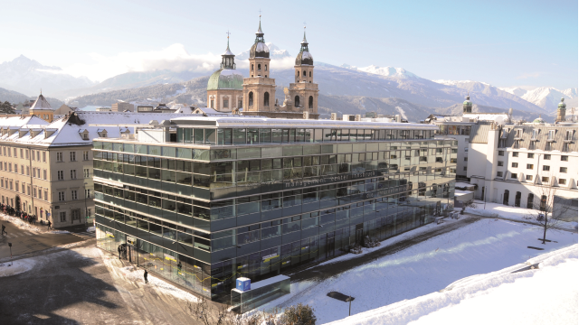
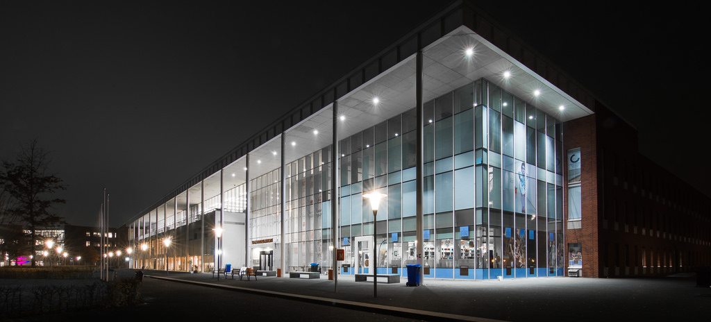

- <b>[About this website](./index.md).</b>
- [University of Nebraska at Omaha](./uno.md).
- [Management Center Innsbruck](./mci.md).
- [University of Wolverhampton](./wlv.md).
- [Hanze University of Applied Sciences](./hanze.md).
- [Time Periods](./time_periods.md).
- [Contact](./contact.md).

## About this website

Hello and welcome to my website!

This website provides an overview of the four different universities I have studied at so far. Each of the links above will let you navigate to a page about the selected university, which will include some general information about the university, as well as an image of the university. This website does not have the intention to serve as a resume, but simply provides a bit of information on each university.

Under "Time Periods" you will find a table which lists from when to when I have attended each university.
Finally, on the "Contact" page you will find my contact details, as well as links to my LinkedIn and GitHub profiles.

## University of Nebraska at Omaha

The University of Nebraska Omaha, often referred to as Omaha or UNO, is a public research university located in Omaha, Nebraska, United States.
Founded in 1908 by faculty from the Omaha Presbyterian Theological Seminary as a private non-sectarian college, the university was originally known as the University of Omaha.
Meant to provide a Christian-based education free from ecclesiastical control, the university served as a strong alternative to the city's many successful religiously affiliated institutions.

## Management Center Innsbruck

MCI Management Center Innsbruck is a privately organized business school in Innsbruck, Austria. The university offers study programs leading to Bachelor and Master degrees as well as Executive Master programs (MBA, MSc, LL.M.), Executive Certificate programs, Management seminars, Customized programs and research.

The Management Center Innsbruck links together the best out of science, economy and consulting to the unique concept of an international Entrepreneurial School®. It stands for internationality, academic quality, practice orientation, innovation, close cooperation with industry, solution-oriented research and development, first-class infrastructure, a high level of customer and service orientation, and international renown.

## University of Wolverhampton

The University of Wolverhampton is an English university located on four campuses across the West Midlands, Shropshire and Staffordshire. The city campus is located in Wolverhampton city centre, with a second campus at Walsall and a third in Telford. There is an additional fourth campus in Wolverhampton at the University of Wolverhampton Science Park.

The university has seven academic schools/faculties and several cross-disciplinary research centres and institutes.
It has 19,560 students and currently offers over 380 undergraduate and postgraduate courses.

## Hanze University of Applied Sciences

Hanze University of Applied Sciences, Groningen is the largest technical & vocational university in the northern Netherlands and is located in Groningen. 
Hanze UAS offers various Bachelor and Master programmes in Dutch, English, and German, and works closely with international partner institutes. 
The school counts approximately 25,000 students and 2,700 employees. 

## Time periods spent at each university

<table>
	<tr>
		<th scope="col">Time Period</th>
		<th scope="col">University</th>
		<th scope="col">City</th>
		<th scope="col">Country</th>
		<th scope="col">Flag</th>
	</tr>
		<tr class="even">
			<td>August 2018 - June 2019</td>
			<td>University of Nebraska at Omaha</td>
			<td>Omaha</td>
			<td>United States</td>
			<td></td>
	</tr>
		<tr class="even">
			<td>October 2017 - September 2019</td>
			<td>Management Center Innsbruck</td>
			<td>Innsbruck</td>
			<td>Austria</td>
			<td></td>
	</tr>
		<tr class="even">
			<td>September 2015 - February 2016</td>
			<td>University of Wolverhampton</td>
			<td>Wolverhampton</td>
			<td>United Kingdom</td>
			<td></td>
	</tr>
		<tr class="even">
			<td>September 2012 - February 2017</td>
			<td>Hanze University of Applied Sciences</td>
			<td>Groningen</td>
			<td>The Netherlands</td>
			<td></td>
		</tr>
</table>
			

## Contact

Please feel free to contact me via e-mail or by phone using the details below, or find out more about me on LinkedIn or GitHub.

- **E-Mail**: wouter.moedt@live.nl

- **Phone**: +31 6 22 18 98 82

https://www.linkedin.com/in/woutermoedt/?locale=en_US"

https://github.com/WouterMoedt/"
