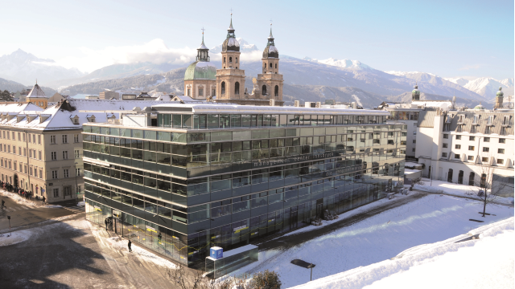

- [About this website](./index.md).
- [University of Nebraska at Omaha](./uno.md).
- <b>[Management Center Innsbruck](./mci.md).</b>
- [University of Wolverhampton](./wlv.md).
- [Hanze University of Applied Sciences](./hanze.md).
- [Time Periods](./time_periods.md).
- [Contact](./contact.md).

## Management Center Innsbruck

MCI Management Center Innsbruck is a privately organized business school in Innsbruck, Austria. The university offers study programs leading to Bachelor and Master degrees as well as Executive Master programs (MBA, MSc, LL.M.), Executive Certificate programs, Management seminars, Customized programs and research.

The Management Center Innsbruck links together the best out of science, economy and consulting to the unique concept of an international Entrepreneurial School®. It stands for internationality, academic quality, practice orientation, innovation, close cooperation with industry, solution-oriented research and development, first-class infrastructure, a high level of customer and service orientation, and international renown.
